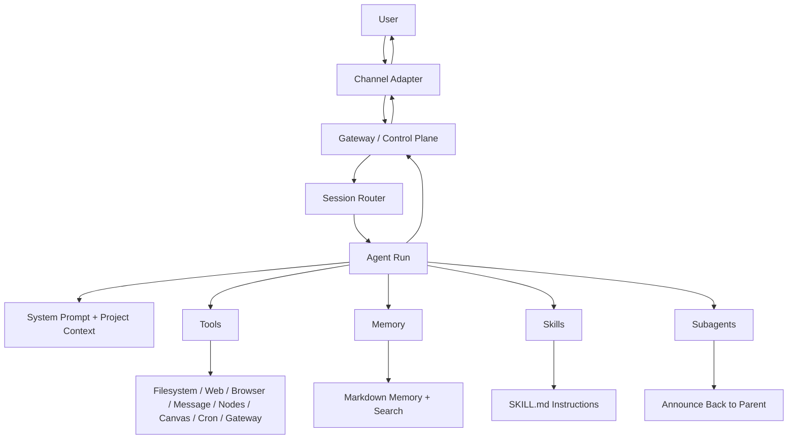

# OpenClaw Full Architecture

> **Focus:** OpenClaw as a local-first, multi-channel assistant gateway

## Core shape

OpenClaw is not just an agent loop. It is a **gateway product** that combines:

- channel adapters
- session routing
- agent runtime
- tools and skills
- local workspace + memory
- optional nodes/devices

## High-level diagram

## Main layers

## 1. Gateway

The gateway is the central control plane.

It handles:

- channel ingress and egress
- session lifecycle
- routing
- config and control UI
- pairing and adapter-specific capabilities

## 2. Sessions

OpenClaw is session-first.

It isolates work by:

- main sessions
- group sessions
- subagent sessions
- optional thread-bound sessions on supported channels

This is a major part of its architecture.

## 3. Agent runtime

Each request becomes an agent run with:

- assembled system prompt
- injected project context
- selected tools
- memory access
- reasoning/tool loop

OpenClaw uses prompt modes:

- `full`
- `minimal`
- `none`

This lets subagents run with smaller prompts.

## 4. Tools and skills

OpenClaw tools are broad and product-oriented:

- file tools
- shell/runtime tools
- browser/web tools
- messaging tools
- session/subagent tools
- cron/gateway tools
- canvas/nodes tools

Skills add usage guidance without changing the runtime itself.

## 5. Memory

OpenClaw memory is file-first:

- injected bootstrap files like `AGENTS.md`, `SOUL.md`, `TOOLS.md`
- curated long-term memory like `MEMORY.md`
- daily logs under `memory/*.md`
- `memory_search` / `memory_get` for targeted recall

So memory is mostly human-editable workspace context plus session-level management.

## 6. Subagents

Subagents are isolated child sessions created through `sessions_spawn`.

They:

- run separately
- do not usually get the full main-session prompt
- return by announce flow
- can be nested if configured

This gives OpenClaw a supervisor/worker architecture without requiring a full task board.

## 7. Surfaces beyond chat

This is where OpenClaw is most different from the others.

It also includes:

- nodes/devices
- canvas
- browser control
- channel-native messaging

So the architecture is shaped around an always-available assistant, not just a coding agent.

## What is special

The most distinctive thing is the combination of:

- messaging gateway
- agent runtime
- local workspace
- device-aware assistant surfaces

## Main weakness

The weakest layer is still deeper orchestration:

- lighter todo/task visibility
- less explicit workflow mode
- weaker structured team coordination than GoClaw

## Bottom line

OpenClaw is best understood as:

> a multi-channel assistant platform with an agent runtime inside it

That is why its architecture feels broader than a normal coding-agent system.
