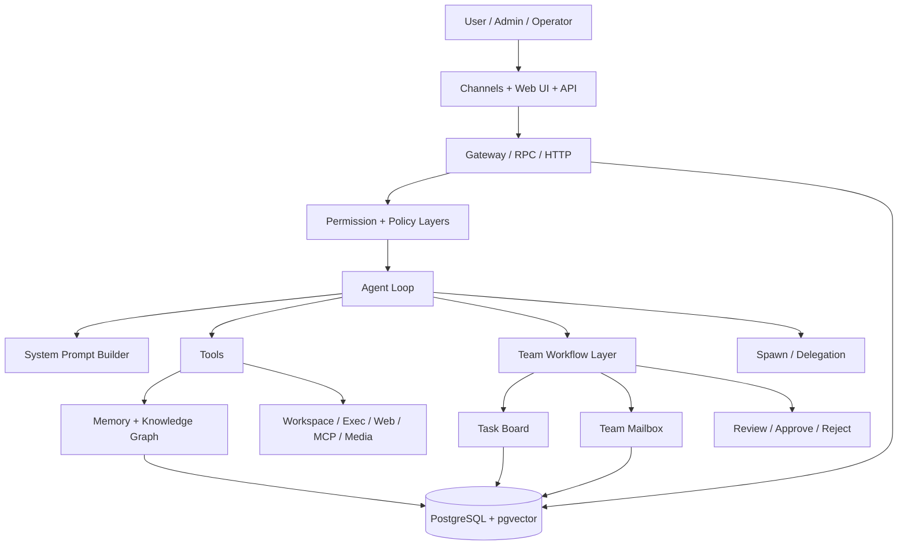

# GoClaw Full Architecture

> **Focus:** GoClaw as a workflow-oriented, multi-tenant agent platform

## Core shape

GoClaw is not just a Go rewrite of OpenClaw. Its architecture pushes harder on:

- multi-tenant storage
- team workflow
- durable task coordination
- stronger operator/control surfaces

## High-level diagram

## Main layers

## 1. Gateway and APIs

GoClaw exposes:

- WebSocket RPC
- HTTP API
- channel adapters
- web dashboard

It is more operator-facing than OpenClaw.

## 2. Security and permissions

GoClaw puts a lot of architecture weight into policy:

- RBAC
- method-level permissions
- tool groups
- workspace restrictions
- approval flows
- tenant isolation

This is one of its defining layers.

## 3. Agent loop

The core loop is still think -> act -> observe, but it is wrapped in a heavier runtime:

- per-user workspace resolution
- system prompt assembly
- memory reminders
- tracing
- workflow-aware delegation

## 4. Prompt and context system

GoClaw has one of the richest open prompt builders:

- persona files
- context files
- tooling section
- skills section
- memory reminders
- team context
- spawn guidance
- runtime section

So a lot of control is expressed through generated prompt structure.

## 5. Memory and retrieval

GoClaw's memory is much more structured than OpenClaw's:

- per-user context files
- `MEMORY.md` and `memory/*.md`
- `memory_search`
- `memory_get`
- automatic indexing
- hybrid retrieval
- knowledge graph

This is closer to an operational knowledge layer than plain workspace notes.

## 6. Team workflow layer

This is the most distinctive part.

GoClaw adds:

- lead/member model
- shared task board
- mailbox
- blocker/dependency handling
- approvals and rejection
- progress states
- team events

This turns delegation into a durable workflow system.

## 7. Spawn and delegation

GoClaw supports both:

- self-clone `spawn`
- named-agent delegation
- full team-mode delegation

So it has more execution modes than many systems, but also more complexity.

## What is special

The most distinctive thing is:

> agent work treated as operational workflow state

That is why GoClaw feels closer to a workflow platform than a simple assistant.

## Main weakness

Its main weakness is not missing features. It is:

- complexity
- heavier default mental model
- risk of overusing the workflow layer

## Bottom line

GoClaw is best understood as:

> a multi-tenant workflow/control platform built around agents

That is why it is strongest at durable team coordination.
