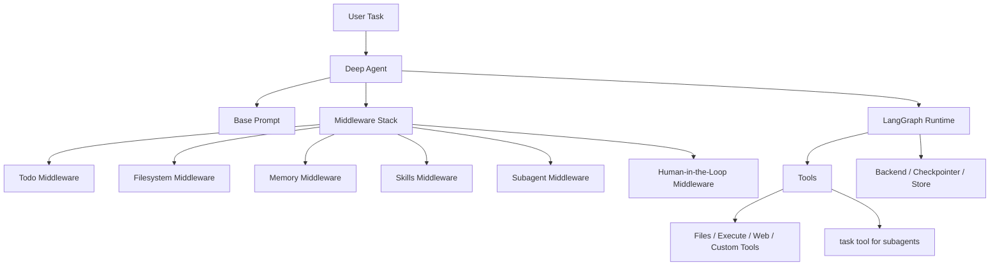

# DeepAgents Full Architecture

> **Focus:** DeepAgents as a supervisor/subagent framework built on LangGraph

## Core shape

DeepAgents is a framework/harness, not a messaging platform.

Its architecture is centered on:

- a base agent prompt
- middleware
- filesystem as working memory
- subagent delegation
- optional long-term memory and backends

## High-level diagram

## Main layers

## 1. Base prompt

DeepAgents starts with a relatively compact base prompt:

- concise behavior rules
- task execution expectations
- progress update expectations

It does not try to encode the entire system in one giant prompt.

## 2. Middleware

This is the main architectural center.

Behavior is added through middleware such as:

- todos
- filesystem
- memory
- skills
- subagents
- summarization
- HITL

This is the biggest difference from heavier prompt-driven systems.

## 3. LangGraph runtime

DeepAgents uses LangGraph for:

- stateful execution
- branching
- checkpointing
- stores
- long-running runs

So LangGraph is the execution substrate under the higher-level harness.

## 4. Filesystem as working memory

DeepAgents strongly treats files as part of reasoning:

- read/write/edit files
- save intermediate work
- avoid stuffing everything into the context window

This is one of its most important design choices.

## 5. Subagents

DeepAgents uses the `task` tool to launch isolated workers.

This gives:

- context isolation
- cleaner parent context
- parallel delegation
- sync and async child patterns

The parent still owns final output.

## 6. Memory and backend layer

DeepAgents separates:

- thread state
- file-based context
- durable memory
- backend storage

This is more programmable than either OpenClaw or GoClaw.

## What is special

The most distinctive thing is:

> clean separation of prompt, middleware, tools, and backend state

That is why it feels like a framework architecture rather than a product architecture.

## Main weakness

Its biggest weakness is product surface:

- no assistant gateway
- no rich built-in workflow board
- less visible collaboration UX

## Bottom line

DeepAgents is best understood as:

> a batteries-included supervisor/subagent architecture kit

That is why it is strongest when you want to build your own agent system cleanly.
