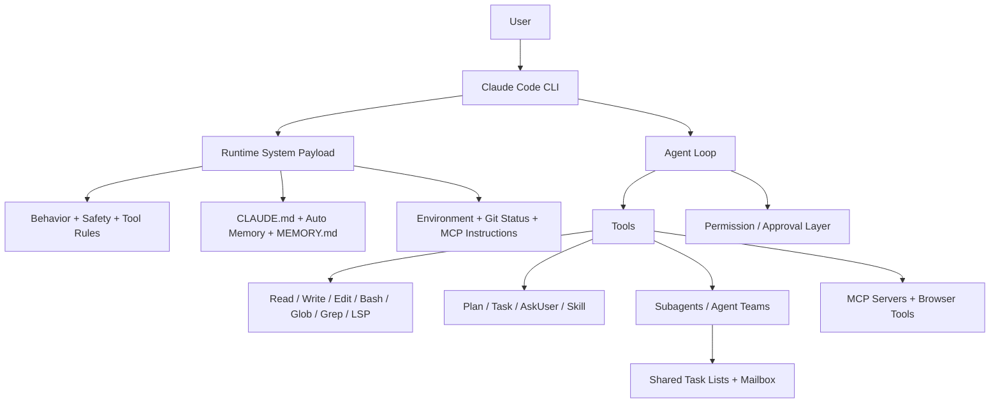

# Claude Code Full Architecture

> **Focus:** Claude Code as a coding-agent control plane

## Core shape

Claude Code is not just "Claude in a terminal." Its architecture combines:

- a large runtime system payload
- tool and permission rules
- memory loading
- subagents and agent teams
- local project context
- MCP integrations

## High-level diagram

## Main layers

## 1. Runtime system payload

Claude Code appears to assemble a very large system layer that includes:

- safety and policy
- coding-task behavior
- tool-usage rules
- risky-action rules
- memory rules
- environment snapshot
- MCP instructions
- git status

This is closer to a runtime operating contract than a small prompt.

## 2. Tool-centered execution

Claude Code is heavily structured around tools:

- file tools
- shell
- planning/task tools
- ask-user tool
- skills
- LSP
- MCP resources
- browser tools
- delegation tools

This is one of the cleanest coding-agent tool surfaces.

## 3. Memory layers

Claude Code separates:

- `CLAUDE.md` instructions
- auto memory
- `MEMORY.md`
- subagent memory scopes

That gives it a stronger memory control plane than most systems.

## 4. Permission and approval layer

A major architectural layer is the runtime approval model:

- permission modes
- hooks
- risky-action confirmations
- differentiated approval behavior per tool/action

This is one reason Claude Code feels controlled rather than chaotic.

## 5. Delegation layers

Claude Code has two multi-agent modes:

- subagents
- agent teams

Subagents handle focused delegated work.
Agent teams handle multi-session collaboration with task lists and mailbox behavior.

## 6. MCP and extensibility

Claude Code integrates MCP as a first-class extension surface.

So capability is not limited to built-in tools; it can also pull in:

- docs/resources
- browser control
- external systems
- custom server instructions

## What is special

The most distinctive thing is:

> a very strong control plane for coding-agent execution

It combines prompt, memory, tools, permissions, and delegation unusually cleanly.

## Main weakness

Its main weaknesses relative to other systems are:

- not a multi-channel assistant gateway like OpenClaw
- less workflow-board-heavy than GoClaw
- much of the architecture is product-managed rather than fully transparent

## Bottom line

Claude Code is best understood as:

> a coding-agent operating system with a strong runtime control plane

That is why it feels so coherent in coding workflows even when many layers are active at once.
